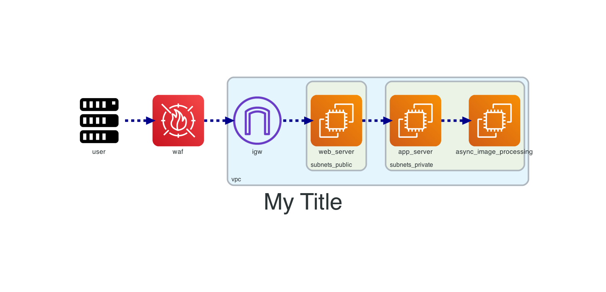
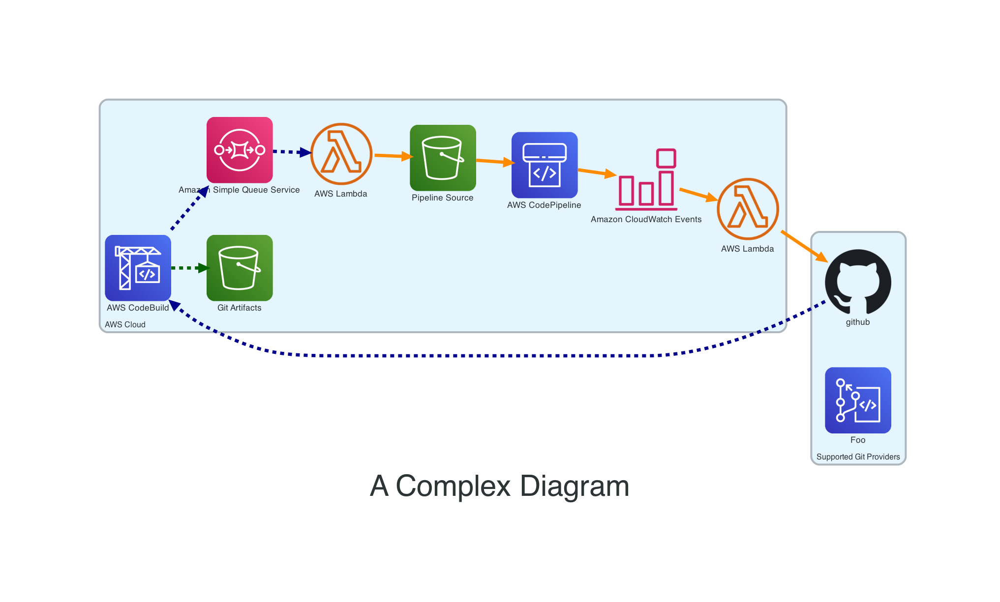

# Diagrams As Code

[](https://github.com/tterb/atomic-design-ui/blob/master/LICENSEs) [](https://forthebadge.com)
[](https://forthebadge.com)


## More On This

I wrote up a blog post on this here: [Sheldon Hull - Diagrams As Code](https://www.sheldonhull.com/diagrams-as-code/)

## Features

- I've dug through the issues and found some great snippets to better configure default behavior.
- This includes a function for tracing the "route" (aka edge).
This allows you to build a path to describe an activity in simple function call, and then alter it to re-render with new path.
Live diagram discussion is easy this way.
- Pre-built poetry tooling and container details gives you a quick start to reuse on a new project for diagrams.
- Diagrams as code... no more visio. What's not to love?## Development Prerequisites

1. [Install go-task](https://github.com/go-task/task/blob/master/docs/installation.md)
2. [Install Poetry](https://python-poetry.org/docs/#installation)
3. Python3

Optional:

- Codespaces configuration included, so open this up in codespaces!

## Example Output





## Development Prerequisites

[Install go-task](https://github.com/go-task/task/blob/master/docs/installation.md)

## Run Locally

From your terminal run `task` to see all prebuild commands.

To initialize project use: `task init`

> NOTE: Due to how diagrams works, you'll have to have one diagram python script file for each diagram.
> I've tried to make it more modular to build the paths as a seperate function, but due to scoping it's not feasible.
> In essence, you'll just have to deal with copy-paste for a new diagram and not reuse much in the same file.

To add a new diagram task to poetry just name a new file and add a new poetry task in `pyproject.toml`.

```toml
[tool.poetry.scripts]
basic = "diag.diagram:main"
complex = "diag.diagram-complex:main"
```

## Dependencies

Project automatically submits dependency updates monthly using Renovate Whitesource.

## Acknowledgements

[Diagrams](https://diagrams.mingrammer.com/)

## License

[MIT](https://choosealicense.com/licenses/mit/)
